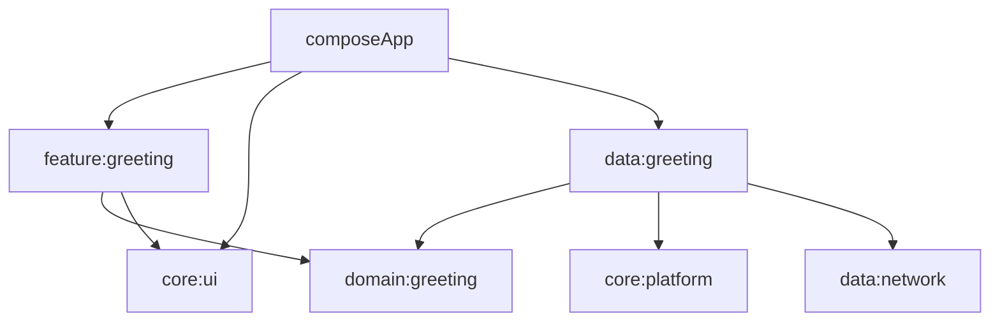

This is a Kotlin Compose Multiplatform project targeting Android, iOS.

### Module Structure

The project uses a multi-module Clean Architecture structure with build-logic convention plugins.



* [/composeApp](./composeApp/src) contains Android and iOS application entry points.
* [/core/platform](./core/platform/src) contains shared platform abstractions and platform-specific implementations.
* [/core/ui](./core/ui/src) contains the shared design system and reusable UI components.
* [/data/network](./data/network/src) contains the shared Ktor client configuration and network DI module.
* [/data/greeting](./data/greeting/src) contains greeting data access and implements domain repository contracts.
* [/domain/greeting](./domain/greeting/src) contains greeting use cases, repository contracts, and JVM unit tests.
* [/feature/greeting](./feature/greeting/src) contains the Greeting MVI state, intent, view model, and screen.
* [/iosApp](./iosApp/iosApp) contains the iOS application entry point.

### Build Logic Convention Plugins

Build setup is centralized in [/build-logic/convention](./build-logic/convention/src/main/kotlin) and split by module category:

* `livving.android.application` / `livving.android.library` configure Android app and library defaults.
* `livving.kotlin.multiplatform.android` / `livving.kotlin.multiplatform.jvm` / `livving.kotlin.multiplatform.ios` configure shared KMP targets by platform category.
* `livving.compose.multiplatform.application` / `livving.compose.multiplatform.library` compose the platform conventions for app and UI modules.
* `livving.koin.core` / `livving.koin.compose` provide dependency injection dependencies.
* `livving.ktor.client` provides Ktor client dependencies and platform engines.
* `livving.coroutines` provides shared coroutine dependencies.

### Build and Run Android Application

To build and run the development version of the Android app, use the run configuration from the run widget
in your IDE's toolbar or build it directly from the terminal:
- on macOS/Linux
  ```shell
  ./gradlew :composeApp:assembleDebug
  ```
- on Windows
  ```shell
  .\gradlew.bat :composeApp:assembleDebug
  ```

### Build and Run iOS Application

To build and run the development version of the iOS app, use the run configuration from the run widget
in your IDE's toolbar or open the [/iosApp](./iosApp) directory in Xcode and run it from there.

---

Learn more about [Kotlin Multiplatform](https://www.jetbrains.com/help/kotlin-multiplatform-dev/get-started.html)...
