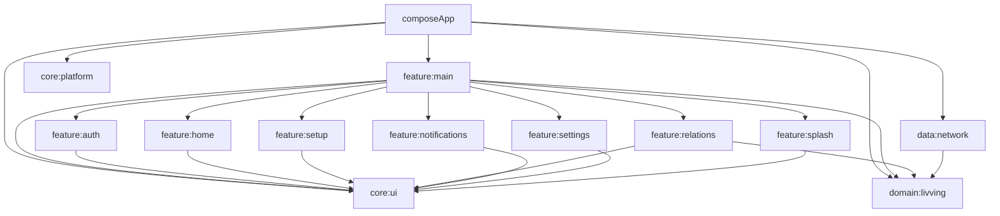

# livving

livving은 사용자가 매일 정해진 시간까지 안부 확인을 하지 않으면, 연결된 보호자에게 푸시 알림을 보내는 안부 확인 앱입니다.

브랜드 의미는 `live + win`입니다. 오늘을 살아내고, 내일을 이겨내는 사람들을 위한 안부 연결 서비스를 지향합니다.

## 프로젝트 개요

- Kotlin Compose Multiplatform 기반 Android + iOS 앱
- 아키텍처: Clean Architecture + MVI
- 계층: `core` / `domain` / `data` / `feature`
- DI: Koin
- 네트워크: Ktor
- UI: Compose Multiplatform
- 화면 전환: Navigation 3 for Compose Multiplatform
- 알림 정책: FCM Push Notification

## MVP 정책

- SMS 문자 발송은 하지 않습니다.
- 보호자도 livving 앱을 설치해야 합니다.
- 보호자 알림은 FCM 푸시 알림으로 처리합니다.
- 카카오톡 메시지의 읽음/전송 성공 여부는 앱에서 알 수 없으므로 표시하지 않습니다.
- 보호자 초대 상태는 DB 상태값으로만 관리합니다.
- 보호자 프로필 이미지는 가져오지 않고 이름 첫 글자 아바타를 사용합니다.
- 연락처 전체 업로드는 하지 않습니다.
- 초대 링크 기반으로 보호 관계를 연결합니다.

## 모듈 구조

이 프로젝트는 build-logic 컨벤션 플러그인을 사용하는 멀티 모듈 구조입니다. `feature:main`은 앱 셸, Navigation 3 back stack, MVI 상태 조립을 담당하고, 실제 화면은 screen 단위 feature 모듈로 분리합니다.



## 모듈 역할

- [`composeApp`](./composeApp/src): Android/iOS 앱 엔트리포인트와 앱 DI 조립을 담당합니다.
- [`core/platform`](./core/platform/src): 플랫폼별 공통 추상화와 구현을 담당합니다.
- [`core/ui`](./core/ui/src): livving 디자인 시스템, 테마, 공통 Compose 컴포넌트를 담당합니다.
- [`data/network`](./data/network/src): Ktorfit API 인터페이스, Ktor 클라이언트 설정, 네트워크 DI 모듈을 담당합니다.
- [`domain/livving`](./domain/livving/src): livving 비즈니스 모델과 UseCase를 담당합니다.
- [`feature/main`](./feature/main/src): 앱 셸, Navigation 3 route key/back stack, MVI 상태, Intent, 메인 ViewModel을 담당합니다.
- [`feature/auth`](./feature/auth/src): 로그인, 약관 화면을 담당합니다.
- [`feature/home`](./feature/home/src): 홈 안부 확인 화면을 담당합니다.
- [`feature/setup`](./feature/setup/src): 안부 마감 시간, 보호자 알림 기준 설정 화면을 담당합니다.
- [`feature/relations`](./feature/relations/src): 보호자, 초대, 보호 중인 사용자 화면을 담당합니다.
- [`feature/notifications`](./feature/notifications/src): 알림, 안부 미확인 상세, 보호자 요청 화면을 담당합니다.
- [`feature/settings`](./feature/settings/src): 설정, 알림 흐름, 프로필, 개인정보, 안부 기록 화면을 담당합니다.
- [`feature/splash`](./feature/splash/src): Android/iOS 공통 스플래시 화면과 진입 타이머 상태를 담당합니다.
- [`iosApp`](./iosApp/iosApp): iOS 애플리케이션 엔트리포인트를 담당합니다.

## 의존성 방향

기본 방향은 앱 조립 모듈에서 하위 모듈을 바라보고, feature는 필요한 domain/core 모듈만 참조합니다.

```text
composeApp
 ├─ feature:main
 ├─ data:network
 ├─ domain:livving
 ├─ core:platform
 └─ core:ui

feature:main
 ├─ feature:auth
 ├─ feature:home
 ├─ feature:setup
 ├─ feature:relations
 ├─ feature:notifications
 ├─ feature:settings
 ├─ feature:splash
 ├─ domain:livving
 └─ core:ui

screen feature
 └─ core:ui

data:network
 └─ domain:livving
```

화면 feature 모듈은 `MainState`, `MainIntent`, `MainRoute`를 직접 참조하지 않습니다. `feature:main`이 Navigation 3 entry에서 화면에 필요한 값과 콜백을 넘겨 조립합니다.

## 네트워크

네트워크 통신은 Ktorfit + Ktor Client를 사용합니다.

- `data:network`는 `livving.ktorfit.client` 컨벤션 플러그인만 적용합니다.
- `livving.ktorfit.client`는 build-logic에서 KSP, Ktorfit KSP processor, Ktorfit lib-light, Ktor Client 의존성을 설정합니다.
- API는 `interface` + Ktorfit annotation으로 선언하고, Koin `networkModule`에서 `HttpClient`, `Ktorfit`, API 구현체를 `single`로 제공합니다.
- Ktor 엔진은 Android `OkHttp`, iOS `Darwin`, JVM `CIO`로 분리합니다.

## Navigation 3

화면 전환은 Compose Multiplatform 공통 코드에서 Navigation 3를 사용합니다.

- route key는 `feature:main`의 `MainRoute` sealed interface로 정의합니다.
- route key는 iOS에서도 저장/복원이 가능하도록 `@Serializable`로 선언하고, `SavedStateConfiguration`에 모든 route serializer를 등록합니다.
- back stack은 Compose가 `rememberNavBackStack(...)`으로 소유합니다.
- `MainViewModel`은 화면 route를 들고 있지 않고, 안부/약관/설정 같은 앱 상태만 `StateFlow`로 노출합니다.
- 바텀 탭 이동은 root route로 back stack을 교체하고, 상세/설정 하위 화면은 stack에 push합니다.
- 팝업, 다이얼로그, 바텀시트 화면은 추후 Navigation 3 scene strategy를 추가해 일반 화면 route와 분리해서 관리합니다.

## MVI와 ViewModel

- 화면 상태는 immutable data class와 `StateFlow`로 관리합니다.
- `MutableStateFlow`는 ViewModel 내부에서만 사용합니다.
- ViewModel은 Koin `viewModel { ... }` DSL로 등록합니다.
- Compose 화면에서는 `koinViewModel()`로 ViewModel을 주입합니다.
- 공통 앱 상태는 `MainViewModel`이 담당하고, 화면 전환 상태는 Navigation 3 back stack이 담당합니다.
- 각 screen feature는 화면별 ViewModel을 가집니다.

예시:

```kotlin
val homeFeatureModule = module {
    viewModel { HomeViewModel() }
}
```

```kotlin
@Composable
fun HomeScreen(
    ...,
    viewModel: HomeViewModel = koinViewModel(),
) {
    ...
}
```

## build-logic 컨벤션 플러그인

모듈 build 파일에는 AGP/KMP 플러그인이나 버전을 직접 선언하지 않습니다. 모든 설정은 [`build-logic/convention`](./build-logic/convention/src/main/kotlin)에 있는 컨벤션 플러그인을 통해 적용합니다.

- `livving.android.application` / `livving.android.library`: Android 앱/라이브러리 기본 설정
- `livving.kotlin.multiplatform.android` / `livving.kotlin.multiplatform.jvm` / `livving.kotlin.multiplatform.ios`: 플랫폼별 KMP target 설정
- `livving.kotlin.multiplatform.library`: Android/JVM/iOS KMP 라이브러리 설정
- `livving.compose.multiplatform.application`: Compose Multiplatform 앱 모듈 설정
- `livving.compose.multiplatform.library`: Compose Multiplatform 라이브러리 모듈 설정
- `livving.koin.core`: Koin core 의존성 설정
- `livving.koin.compose`: Koin Compose 및 Koin ViewModel 의존성 설정
- `livving.ktor.client`: Ktor 클라이언트와 플랫폼 엔진 의존성 설정
- `livving.ktorfit.client`: KSP 플러그인, Ktorfit KSP processor, Ktorfit lib-light, Ktor 클라이언트 설정
- `livving.coroutines`: Coroutines 의존성 설정
- `livving.navigation3`: Navigation 3와 route key 직렬화 의존성 설정

## 실행 및 검증

Android 디버그 빌드:

```shell
./gradlew :composeApp:assembleDebug
```

iOS simulator arm64 Kotlin 컴파일:

```shell
./gradlew :composeApp:compileKotlinIosSimulatorArm64
```

domain JVM 테스트:

```shell
./gradlew :domain:livving:jvmTest
```

전체 주요 검증:

```shell
./gradlew :domain:livving:jvmTest :composeApp:assembleDebug :composeApp:compileKotlinIosSimulatorArm64
```
